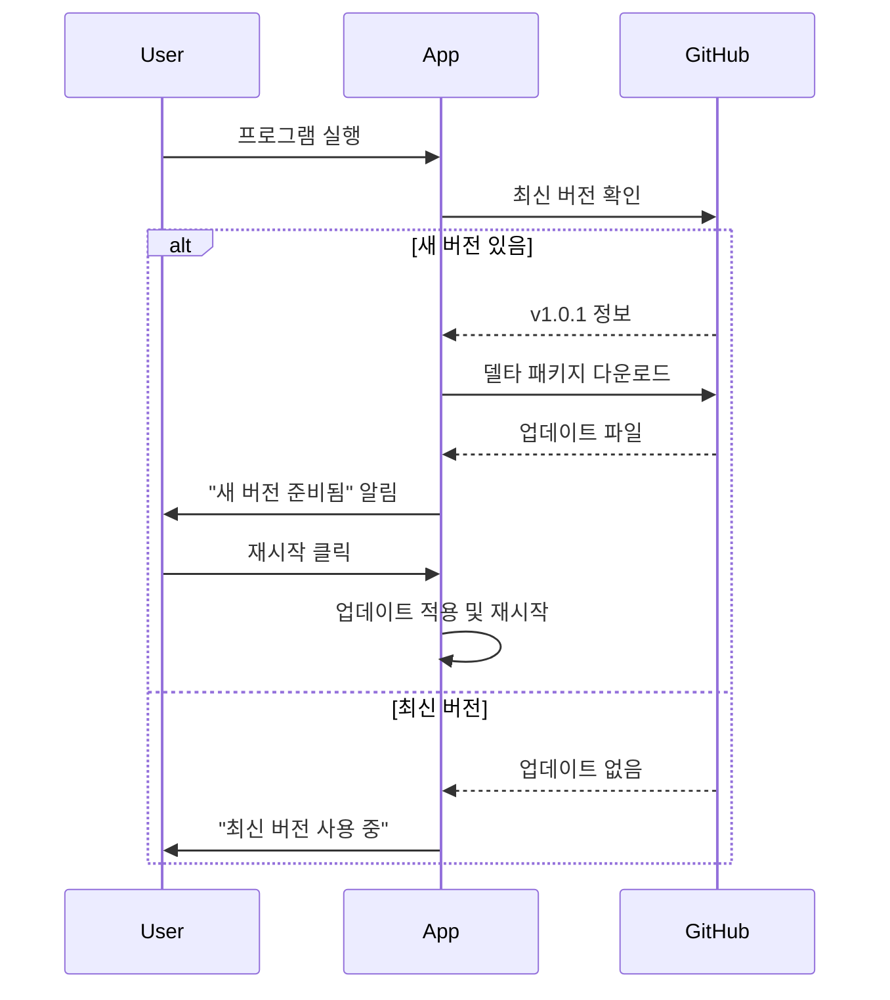

# OneClick - 자동 업데이트 가이드

## 🚀 빠른 시작

### 개발자용: 새 버전 배포하기

1. **코드 변경 및 커밋**
   ```bash
   git add .
   git commit -m "Release v1.0.1: 새로운 기능 추가"
   ```

2. **버전 태그 생성 및 푸시**
   ```bash
   git tag v1.0.1
   git push origin v1.0.1
   ```

3. **자동 빌드 확인**
   - GitHub Actions가 자동으로 실행됩니다
   - [Actions 탭](https://github.com/youn-yong-seung/one-click-program/actions)에서 진행 상황 확인
   - 완료되면 [Releases](https://github.com/youn-yong-seung/one-click-program/releases)에 자동 업로드

### 사용자용: 프로그램 설치 및 업데이트

#### 신규 설치
1. [Releases 페이지](https://github.com/youn-yong-seung/one-click-program/releases/latest)에서 `OneClick-Setup.exe` 다운로드
2. 다운로드한 파일 실행
3. 설치 완료!

#### 자동 업데이트
- 프로그램 실행 시 자동으로 업데이트 확인
- 설정 페이지에서 새 버전 알림 확인
- "지금 재시작하고 업데이트" 버튼 클릭
- 프로그램이 자동으로 재시작되며 업데이트 적용

---

## 📋 시스템 요구사항

- Windows 10/11 (64-bit)
- .NET 8.0 Runtime (자동 설치됨)
- 인터넷 연결 (업데이트 확인용)

---

## 🔧 로컬 빌드 (개발자용)

### 사전 준비

1. **.NET 8.0 SDK 설치**
   ```bash
   winget install Microsoft.DotNet.SDK.8
   ```

2. **Velopack CLI 설치**
   ```bash
   dotnet tool install -g vpk
   ```

### 빌드 실행

```powershell
.\build-release.ps1 -Version "1.0.0"
```

빌드 결과물은 `./releases` 폴더에 생성됩니다:
- `OneClick-Setup.exe` - 초기 설치 프로그램
- `OneClick-1.0.0-full.nupkg` - 전체 패키지
- `OneClick-1.0.0-delta.nupkg` - 델타 업데이트 (이전 버전 대비)

---

## 🔄 자동 업데이트 작동 방식



### 주요 특징

✅ **자동 감지**: 프로그램 시작 시 자동으로 업데이트 확인  
✅ **백그라운드 다운로드**: 사용자가 작업하는 동안 백그라운드에서 다운로드  
✅ **델타 업데이트**: 변경된 부분만 다운로드하여 빠른 업데이트  
✅ **원클릭 적용**: 버튼 한 번으로 업데이트 완료  

---

## 📦 GitHub Actions 워크플로우

### 트리거 조건

워크플로우는 다음 조건에서 자동 실행됩니다:
- `v*.*.*` 형식의 태그가 푸시될 때 (예: `v1.0.0`, `v2.1.3`)

### 빌드 단계

1. **환경 설정**: .NET 8.0 SDK 및 Velopack CLI 설치
2. **의존성 복원**: NuGet 패키지 복원
3. **애플리케이션 빌드**: Release 모드로 빌드
4. **Velopack 패키징**: 설치 프로그램 및 업데이트 패키지 생성
5. **GitHub Release 생성**: 자동으로 릴리스 노트와 함께 업로드

### 권한 설정

> **중요**: GitHub Actions가 Releases를 생성하려면 권한이 필요합니다.

**설정 방법**:
1. GitHub 저장소 → **Settings** → **Actions** → **General**
2. "Workflow permissions" 섹션에서 **"Read and write permissions"** 선택
3. **Save** 클릭

---

## 🐛 문제 해결

### 업데이트 확인 실패

**증상**: "업데이트 확인 실패" 메시지 표시

**해결 방법**:
1. 인터넷 연결 확인
2. GitHub 서버 상태 확인: [status.github.com](https://www.githubstatus.com/)
3. 방화벽에서 프로그램 허용 확인

### 업데이트 다운로드 실패

**증상**: 업데이트 감지 후 다운로드 중 오류

**해결 방법**:
1. 디스크 공간 확인 (최소 500MB 필요)
2. 안티바이러스 소프트웨어 예외 설정
3. 프로그램 재시작 후 재시도

### GitHub Actions 빌드 실패

**증상**: Actions 탭에서 빌드 실패 표시

**해결 방법**:
1. 빌드 로그 확인
2. 버전 형식 확인 (반드시 `X.Y.Z` 형식)
3. 권한 설정 확인 (위 "권한 설정" 섹션 참조)

---

## 📝 버전 관리 규칙

### Semantic Versioning

버전은 `MAJOR.MINOR.PATCH` 형식을 따릅니다:

- **MAJOR**: 호환되지 않는 API 변경
- **MINOR**: 하위 호환되는 기능 추가
- **PATCH**: 하위 호환되는 버그 수정

**예시**:
- `1.0.0` → `1.0.1`: 버그 수정
- `1.0.1` → `1.1.0`: 새 기능 추가
- `1.1.0` → `2.0.0`: 주요 변경 (호환성 깨짐)

### 태그 생성 규칙

```bash
# 올바른 예시 ✅
git tag v1.0.0
git tag v1.2.3
git tag v2.0.0-beta.1

# 잘못된 예시 ❌
git tag 1.0.0        # 'v' 접두사 없음
git tag v1.0         # PATCH 버전 누락
git tag version-1.0  # 잘못된 형식
```

---

## 🔐 보안 고려사항

### 코드 서명 (권장)

프로덕션 배포 시 코드 서명을 추가하는 것을 권장합니다:

```powershell
# build-release.ps1에 추가
vpk pack `
    --packId "OneClick" `
    --packVersion $Version `
    --packDir ./publish `
    --mainExe "OneClick.Client.exe" `
    --outputDir ./releases `
    --signParams "/f path/to/certificate.pfx /p password"
```

### 업데이트 검증

Velopack은 자동으로 다음을 검증합니다:
- 패키지 무결성 (SHA256 해시)
- 버전 호환성
- 서명 유효성 (서명된 경우)

---

## 📚 추가 리소스

- [Velopack 공식 문서](https://docs.velopack.io/)
- [GitHub Actions 문서](https://docs.github.com/en/actions)
- [Semantic Versioning 가이드](https://semver.org/lang/ko/)

---

## 💡 팁

### 빠른 테스트

로컬에서 업데이트 시스템을 테스트하려면:

1. 버전 1.0.0으로 빌드 및 설치
2. 코드 수정
3. 버전 1.0.1로 빌드
4. `releases` 폴더를 웹 서버에 호스팅 (예: `python -m http.server 8000`)
5. `UpdateService.cs`에서 GitHub URL을 로컬 서버로 변경
6. 프로그램 실행 후 업데이트 확인

### 델타 업데이트 최적화

델타 업데이트는 **직전 버전**에 대해서만 생성됩니다:
- v1.0.0 → v1.0.1: 델타 사용 가능 ✅
- v1.0.0 → v1.0.2: 전체 다운로드 (v1.0.1 건너뜀)

따라서 버전을 순차적으로 릴리스하는 것이 좋습니다.

---

## 🤝 기여하기

버그 리포트나 기능 제안은 [Issues](https://github.com/youn-yong-seung/one-click-program/issues)에 등록해주세요.

---

## 📄 라이선스

이 프로젝트는 [라이선스 정보]에 따라 배포됩니다.
