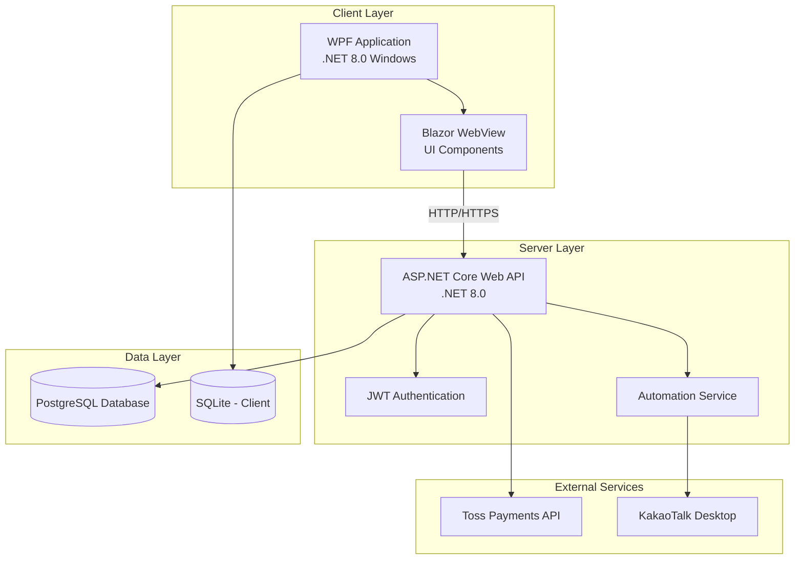
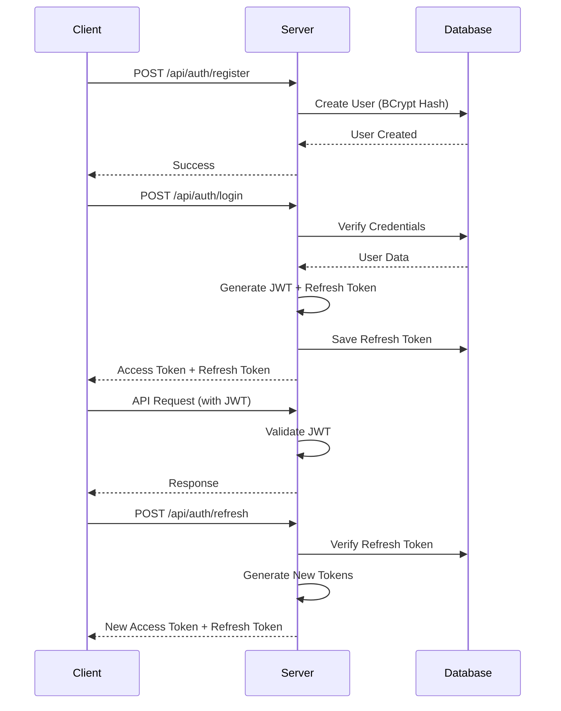
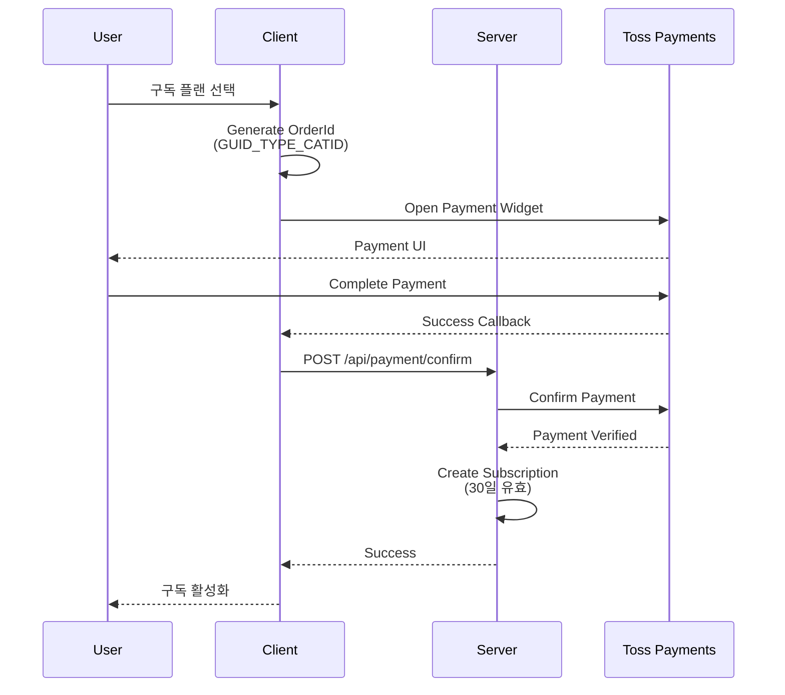
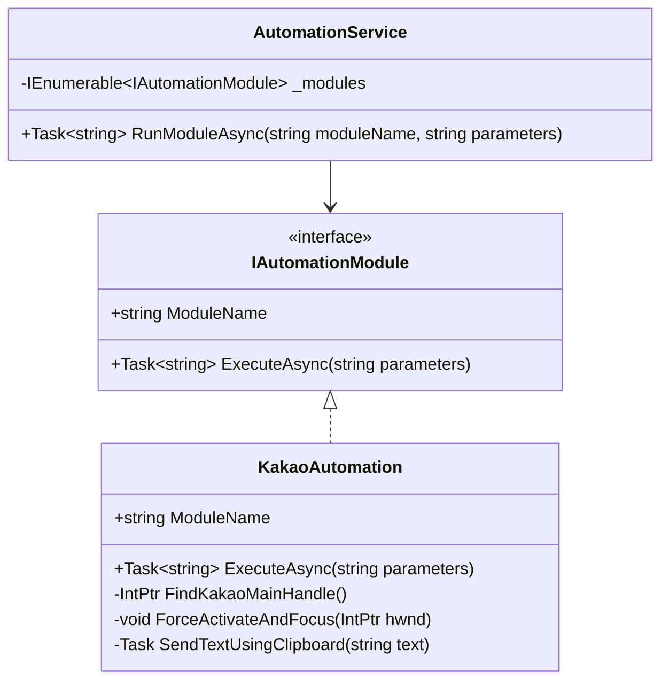
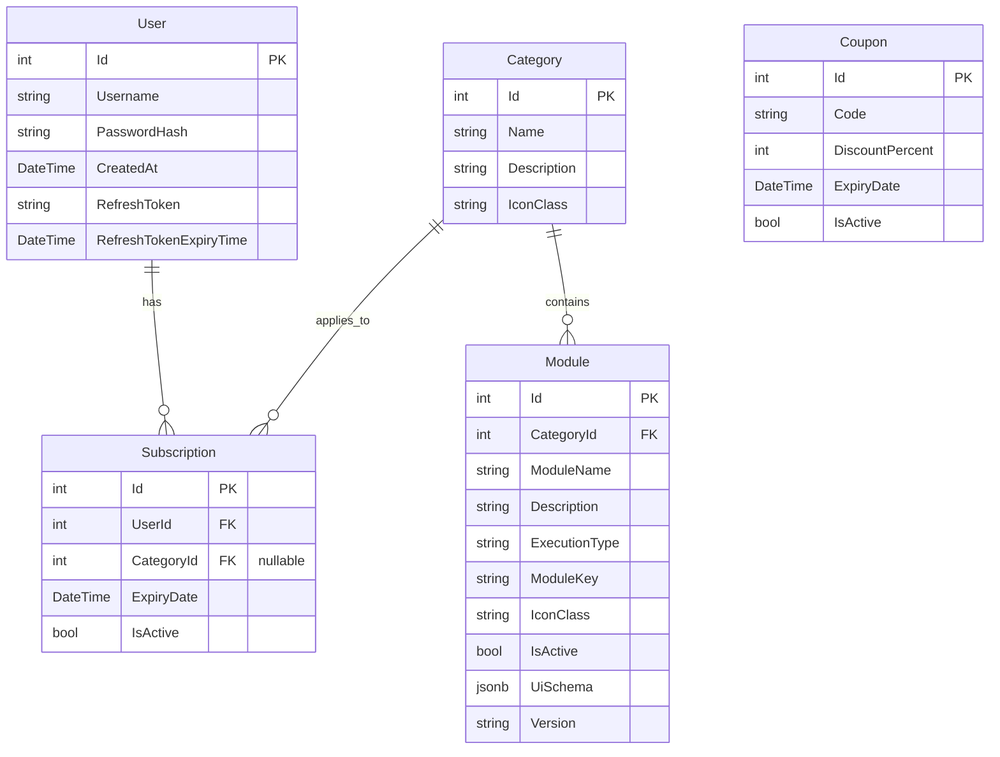

# OneClick Program - 프로그램 분석

## 📋 개요

**OneClick**은 윤자동 원클릭 상품개발 프로젝트로, 다양한 SNS 및 메신저 플랫폼에서 자동화 작업을 수행할 수 있는 **데스크톱 애플리케이션**입니다. 클라이언트-서버 아키텍처를 기반으로 하며, 구독 기반 비즈니스 모델을 채택하고 있습니다.

---

## 🏗️ 시스템 아키텍처

### 전체 구조



### 프로젝트 구성

| 프로젝트 | 타입 | 설명 |
|---------|------|------|
| **OneClick.Client** | WPF + Blazor Hybrid | 데스크톱 클라이언트 애플리케이션 |
| **OneClick.Server** | ASP.NET Core Web API | 백엔드 서버 및 자동화 엔진 |
| **OneClick.Shared** | Class Library | 공유 DTO 및 모델 |

---

## 💻 기술 스택

### Client (OneClick.Client)

- **Framework**: .NET 8.0 (Windows)
- **UI Technology**: WPF + Blazor WebView
- **Key Packages**:
  - `Microsoft.AspNetCore.Components.WebView.Wpf` (8.0.3) - Blazor 통합
  - `Microsoft.EntityFrameworkCore.Sqlite` (8.0.0) - 로컬 저장소
  - `Velopack` (0.0.1298) - 자동 업데이트
  - `Microsoft.Extensions.Hosting` (8.0.0) - DI 컨테이너

### Server (OneClick.Server)

- **Framework**: .NET 8.0
- **Database**: PostgreSQL (Npgsql.EntityFrameworkCore.PostgreSQL 8.0.0)
- **Authentication**: JWT Bearer Token
- **Key Packages**:
  - `BCrypt.Net-Next` (4.0.3) - 비밀번호 해싱
  - `Microsoft.AspNetCore.Authentication.JwtBearer` (8.0.0)
  - `Swashbuckle.AspNetCore` (6.6.2) - API 문서화

### Database Configuration

```json
{
  "ConnectionStrings": {
    "DefaultConnection": "Host=localhost;Port=5432;Database=OneClick;Username=skoo1100;Password=dnjf1djrRi!@"
  },
  "Jwt": {
    "Key": "ThisIsASecretKey1234567890_VerySecureKey_ChangeItInProd"
  }
}
```

> [!WARNING]
> 데이터베이스 자격 증명과 JWT 키가 `appsettings.json`에 평문으로 저장되어 있습니다. 프로덕션 환경에서는 반드시 User Secrets, Azure Key Vault 등의 보안 저장소를 사용해야 합니다.

---

## 🎯 핵심 기능

### 1. 사용자 인증 및 권한 관리

#### 인증 플로우



#### 주요 특징

- **BCrypt 비밀번호 해싱**: 안전한 비밀번호 저장
- **JWT Access Token**: 60분 유효기간
- **Refresh Token**: 7일 유효기간, 자동 로그인 유지
- **토큰 갱신**: 만료된 토큰 자동 갱신 메커니즘

### 2. 구독 및 결제 시스템

#### 구독 모델

| 플랜 타입 | 설명 | CategoryId |
|----------|------|-----------|
| **올인원 무제한** | 모든 카테고리 접근 가능 | `null` |
| **단일 카테고리** | 특정 카테고리만 접근 | 카테고리 ID |

#### 결제 프로세스 (Toss Payments)



#### OrderId 형식

```
{GUID}_{TYPE}_{CATEGORY_ID}
```

- **TYPE**: `ALL` (전체) 또는 `SINGLE` (단일)
- **CATEGORY_ID**: 단일 카테고리의 경우 카테고리 ID, 전체의 경우 0

> [!IMPORTANT]
> 현재 테스트 Secret Key(`test_sk_Z60kL2q_024K7k1p9b88rYow54eW`)가 하드코딩되어 있습니다. 프로덕션 배포 시 환경 변수로 관리해야 합니다.

### 3. 자동화 모듈 시스템

#### 아키텍처



#### 현재 구현된 모듈

##### KakaoAutomation (카카오톡 자동화)

**기능**: 여러 채팅방에 동일한 메시지 일괄 전송

**기술 스택**:
- Win32 API (P/Invoke)
- 클립보드 조작
- 윈도우 핸들 조작

**동작 방식**:

1. **카카오톡 메인 윈도우 찾기**
   ```csharp
   // EVA_Window_Dblclk 클래스를 가진 윈도우 검색
   // 내부 구조 검증 (EVA_ChildWindow → EVA_Window)
   IntPtr hwndMain = FindKakaoMainHandle();
   ```

2. **채팅방 검색**
   - 방법 A: 검색 Edit 컨트롤 직접 조작 (`WM_SETTEXT`)
   - 방법 B (Fallback): `Ctrl+F` 단축키 사용

3. **메시지 전송**
   ```csharp
   // AttachThreadInput으로 강제 포커스
   ForceActivateAndFocus(hwndRoom);
   
   // 클립보드를 통한 메시지 입력
   await SendTextUsingClipboard(message, pressEnter: true);
   ```

4. **취소 지원**
   - `CancellationToken`을 통한 작업 중단

**입력 파라미터** (JSON):
```json
{
  "roomName": "채팅방1\n채팅방2\n채팅방3",
  "message": "전송할 메시지"
}
```

> [!NOTE]
> 향후 Instagram, Facebook 등 다른 플랫폼 자동화 모듈 추가 예정

---

## 📊 데이터 모델

### ERD



### 주요 모델 설명

#### User
- 사용자 계정 정보
- BCrypt 해싱된 비밀번호
- Refresh Token 저장 (자동 로그인)

#### Module
- 자동화 기능 정의
- **ExecutionType**: `ServerAutomation` (서버 실행) 또는 `LocalExe` (로컬 실행)
- **ModuleKey**: 실제 구현체 식별자 (예: "KakaoBot")
- **UiSchema**: 동적 UI 생성을 위한 JSON 스키마

#### Subscription
- 사용자의 구독 정보
- **CategoryId가 null**: 전체 카테고리 접근 가능
- **CategoryId가 특정 값**: 해당 카테고리만 접근 가능
- 30일 유효기간

---

## 🔌 API 엔드포인트

### Authentication (`/api/auth`)

| Method | Endpoint | Description | Auth Required |
|--------|----------|-------------|---------------|
| POST | `/register` | 사용자 등록 | ❌ |
| POST | `/login` | 로그인 (JWT 발급) | ❌ |
| POST | `/refresh` | 토큰 갱신 | ❌ |
| POST | `/change-password` | 비밀번호 변경 | ✅ |

### Payment (`/api/payment`)

| Method | Endpoint | Description | Auth Required |
|--------|----------|-------------|---------------|
| POST | `/confirm` | 결제 확인 및 구독 활성화 | ✅ |

### Module (`/api/module`)

| Method | Endpoint | Description | Auth Required |
|--------|----------|-------------|---------------|
| GET | `/` | 모듈 목록 조회 | ✅ |
| POST | `/run/{id}` | 모듈 실행 | ✅ |

### Category (`/api/category`)

| Method | Endpoint | Description | Auth Required |
|--------|----------|-------------|---------------|
| GET | `/` | 카테고리 목록 조회 | ✅ |

### Subscription (`/api/subscription`)

| Method | Endpoint | Description | Auth Required |
|--------|----------|-------------|---------------|
| GET | `/my` | 내 구독 정보 조회 | ✅ |

---

## 🎨 클라이언트 UI 구조

### 페이지 구성

```
OneClick.Client/Pages/
├── Index.razor                    # 랜딩 페이지
├── Login.razor                    # 로그인
├── Register.razor                 # 회원가입
├── Dashboard/
│   ├── Home.razor                # 대시보드 홈 (모듈 목록)
│   ├── ModuleDetail.razor        # 모듈 상세 및 실행
│   ├── Library.razor             # 라이브러리
│   ├── Tools.razor               # 도구
│   ├── Settings.razor            # 설정 (비밀번호 변경)
│   └── Subscription.razor        # 구독 관리 및 결제
└── Payment/
    ├── Success.razor             # 결제 성공
    └── Fail.razor                # 결제 실패
```

### 주요 서비스

#### TokenService
- JWT 토큰 관리
- 로컬 저장 및 자동 갱신

#### JwtDelegatingHandler
- HTTP 요청에 자동으로 JWT 헤더 추가
- 401 Unauthorized 시 자동 로그인 페이지 이동

#### LocalSettingsService
- SQLite 기반 로컬 설정 저장
- 사용자 환경 설정 관리

#### PaymentService
- Toss Payments 연동
- 결제 위젯 초기화 및 처리

---

## 🔧 주요 기술 구현

### 1. Blazor WebView in WPF

[MainWindow.xaml.cs](file:///c:/Users/User/OneDrive/Desktop/외주%20의뢰%20건/2026/윤자동%20원클릭%20상품개발%20프로젝트/One%20Click%20Program/OneClick.Client/MainWindow.xaml.cs)에서 WPF와 Blazor를 통합:

```csharp
// GPU 비활성화 (렌더링 크래시 방지)
Environment.SetEnvironmentVariable("WEBVIEW2_ADDITIONAL_BROWSER_ARGUMENTS", "--disable-gpu");

// Blazor WebView 서비스 등록
Services.AddWpfBlazorWebView();

// 팝업 처리 (Toss Payments)
webView2.NewWindowRequested += (ws, wargs) =>
{
    wargs.Handled = true;
    webView2.Navigate(wargs.Uri); // 현재 뷰에서 열기
};
```

### 2. 동적 UI 생성 (UiSchema)

모듈별로 다른 입력 폼을 JSON 스키마로 정의:

```json
{
  "fields": [
    {
      "key": "roomName",
      "label": "채팅방 이름",
      "type": "textarea",
      "placeholder": "채팅방 이름을 한 줄에 하나씩 입력하세요",
      "rows": 5
    },
    {
      "key": "message",
      "label": "메시지",
      "type": "textarea",
      "placeholder": "전송할 메시지를 입력하세요",
      "rows": 10
    }
  ]
}
```

[ModuleDetail.razor](file:///c:/Users/User/OneDrive/Desktop/외주%20의뢰%20건/2026/윤자동%20원클릭%20상품개발%20프로젝트/One%20Click%20Program/OneClick.Client/Pages/Dashboard/ModuleDetail.razor)에서 동적으로 렌더링.

### 3. Win32 API 자동화

[KakaoAutomation.cs](file:///c:/Users/User/OneDrive/Desktop/외주%20의뢰%20건/2026/윤자동%20원클릭%20상품개발%20프로젝트/One%20Click%20Program/OneClick.Server/Services/Automation/Modules/KakaoAutomation.cs)에서 P/Invoke 사용:

```csharp
[DllImport("user32.dll")]
private static extern IntPtr FindWindowEx(IntPtr hwndParent, IntPtr hwndChildAfter, string lpszClass, string lpszWindow);

[DllImport("user32.dll")]
private static extern bool AttachThreadInput(uint idAttach, uint idAttachTo, bool fAttach);

// 강제 포커스
private void ForceActivateAndFocus(IntPtr hwndWindow)
{
    uint foreThread = GetWindowThreadProcessId(GetForegroundWindow(), IntPtr.Zero);
    uint targetThread = GetWindowThreadProcessId(hwndWindow, IntPtr.Zero);
    
    AttachThreadInput(foreThread, appThread, true);
    SetForegroundWindow(hwndWindow);
    AttachThreadInput(foreThread, appThread, false);
}
```

---

## 🚀 배포 및 업데이트

### Velopack 자동 업데이트

- 클라이언트에 `Velopack` 패키지 통합
- 서버에서 정적 파일 제공 (`app.UseStaticFiles()`)
- 자동 업데이트 체크 및 설치

---

## ⚠️ 보안 고려사항

### 현재 이슈

1. **자격 증명 노출**
   - PostgreSQL 연결 문자열이 `appsettings.json`에 평문 저장
   - JWT Secret Key 하드코딩

2. **Toss Payments 테스트 키**
   - 프로덕션 키로 교체 필요

3. **HTTPS 비활성화**
   ```csharp
   options.RequireHttpsMetadata = false; // 개발 환경용
   ```

### 권장 개선사항

- [ ] User Secrets 또는 환경 변수 사용
- [ ] Azure Key Vault 통합
- [ ] HTTPS 강제 적용
- [ ] Rate Limiting 구현
- [ ] SQL Injection 방지 (현재 EF Core 사용으로 기본 보호됨)

---

## 📈 확장 가능성

### 모듈 추가 방법

1. `IAutomationModule` 인터페이스 구현
2. `Program.cs`에 DI 등록
   ```csharp
   builder.Services.AddScoped<IAutomationModule, NewAutomation>();
   ```
3. 데이터베이스에 모듈 정보 추가 (Seeding)

### 지원 예정 플랫폼

- Instagram 자동화
- Facebook 자동화
- 기타 SNS 플랫폼

---

## 🛠️ 개발 환경 설정

### 필수 요구사항

- .NET 8.0 SDK
- PostgreSQL 15+
- Visual Studio 2022 (권장)
- Windows 10/11

### 실행 방법

1. **데이터베이스 설정**
   ```bash
   # PostgreSQL 설치 및 실행
   # Database: OneClick
   # User: skoo1100
   ```

2. **서버 실행**
   ```bash
   cd OneClick.Server
   dotnet run
   # http://localhost:5000
   ```

3. **클라이언트 실행**
   ```bash
   cd OneClick.Client
   dotnet run
   ```

---

## 📝 주요 파일 및 디렉토리

### Server

- [Program.cs](file:///c:/Users/User/OneDrive/Desktop/외주%20의뢰%20건/2026/윤자동%20원클릭%20상품개발%20프로젝트/One%20Click%20Program/OneClick.Server/Program.cs) - 서버 진입점 및 DI 설정
- [Controllers/](file:///c:/Users/User/OneDrive/Desktop/외주%20의뢰%20건/2026/윤자동%20원클릭%20상품개발%20프로젝트/One%20Click%20Program/OneClick.Server/Controllers) - API 엔드포인트
- [Services/Automation/](file:///c:/Users/User/OneDrive/Desktop/외주%20의뢰%20건/2026/윤자동%20원클릭%20상품개발%20프로젝트/One%20Click%20Program/OneClick.Server/Services/Automation) - 자동화 모듈
- [Models/](file:///c:/Users/User/OneDrive/Desktop/외주%20의뢰%20건/2026/윤자동%20원클릭%20상품개발%20프로젝트/One%20Click%20Program/OneClick.Server/Models) - 데이터 모델

### Client

- [MainWindow.xaml.cs](file:///c:/Users/User/OneDrive/Desktop/외주%20의뢰%20건/2026/윤자동%20원클릭%20상품개발%20프로젝트/One%20Click%20Program/OneClick.Client/MainWindow.xaml.cs) - WPF 메인 윈도우
- [Pages/Dashboard/](file:///c:/Users/User/OneDrive/Desktop/외주%20의뢰%20건/2026/윤자동%20원클릭%20상품개발%20프로젝트/One%20Click%20Program/OneClick.Client/Pages/Dashboard) - Blazor 페이지
- [Services/](file:///c:/Users/User/OneDrive/Desktop/외주%20의뢰%20건/2026/윤자동%20원클릭%20상품개발%20프로젝트/One%20Click%20Program/OneClick.Client/Services) - 클라이언트 서비스

---

## 💡 결론

OneClick은 **모듈식 아키텍처**를 기반으로 한 확장 가능한 자동화 플랫폼입니다. 현재 카카오톡 자동화를 지원하며, 향후 다양한 SNS 플랫폼으로 확장 가능한 구조를 갖추고 있습니다. 

**주요 강점**:
- ✅ 깔끔한 클라이언트-서버 분리
- ✅ JWT 기반 보안 인증
- ✅ 구독 기반 수익 모델
- ✅ 확장 가능한 모듈 시스템
- ✅ 자동 업데이트 지원

**개선 필요 사항**:
- ⚠️ 보안 강화 (자격 증명 관리)
- ⚠️ 에러 처리 개선
- ⚠️ 로깅 시스템 구축
- ⚠️ 단위 테스트 추가
